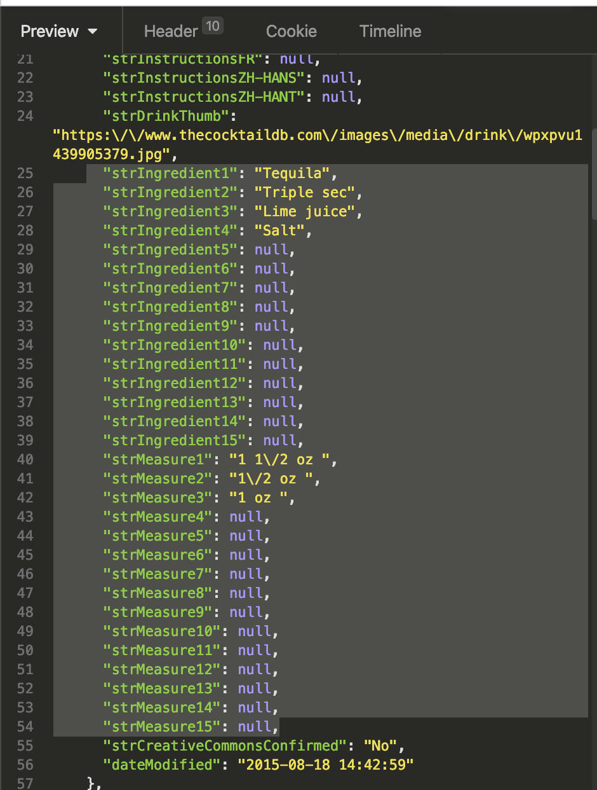
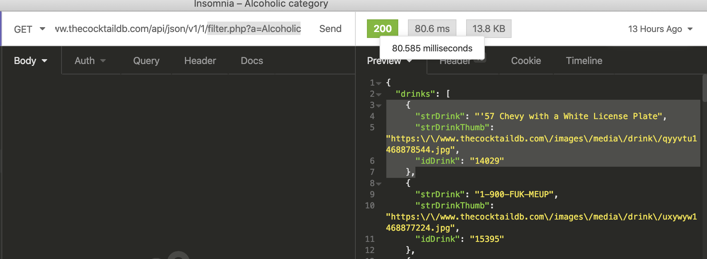
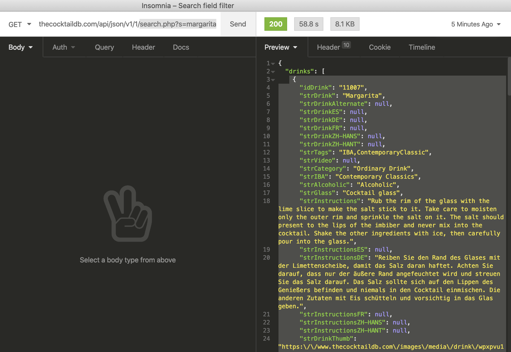

###  General Assembly, Software Engineering Immersive
# Drinkalicious 

by [Denise Cheung](https://github.com/denisecheung3) & [Ben Harris](https://github.com/benharris8)

## Overview

Cocktailicious is my second project with General Assembly during the software engineering immersive course. Ben and I had to **build a multi-page React web app** that consumes a **public API** within a mini **48 hour** hackathon. 

After deliberation, we have decicded to go with the CocktailDB API and built a website where users can: 
- View a list of drinks and filter by category (beer, cocktail, etc) 
- Search for drinks by name, ingredient or alcoholic/non-alcholic 
- Favourite any drinks they come across and access this in the 'favourites' tab 

Please do feel free to spice up your night and find a great drink with Drinkalicious [here](https://denisecheung3.github.io/project-2), or find the  GitHub repo [here](https://github.com/denisecheung3/project-2).

## Brief
- **Consume a public API** – this could be anything but it must make sense for your project.
- **Have several components** - At least one classical and one functional.
- **The app should include a router** - with several "pages".
- **Be deployed online** and accessible to the public.

## Technologies used
- JavaScript (ES6)
- React.js
- HTML, JSX
- CocktailDB API
- Axios 
- Webpack
- Git and GitHub
- Bulma, SCSS

## Approach

​

After deciding to go with the CocktailDB API, we wireframed the website and brainstormed what features we wanted to have:
  - A home page 
  - A navigation bar
  - An drinks page where users can filter drinks by categories (e.g: if user chose 'cocktail' in the dropdown menu, all cocktails will be shown. The user can click on a drink to view more information about that drink 
  - A page that shows more details of the drink the user clicked on 
  - A Search page with a search form so the user can search for drinks by name, ingredient or alcoholic/non-alcholic 
  - Ability for user to favourite drinks they like (stretch goal)
  - A 'favourite' page where the user can view the drinks they favourited (stretch goal)


The routing of our page are:
  1. The home page at path "/"
  2. The Drinks page at path "/Drinks"
  3. The Single Drink page at path "/drink/:id"
  4. The Search form page at path "/Search"
  5. A page to display the search results after search form is submitted at path "/searchResults"
  6. A page to display the user's favourited drinks at path="/favourites"


### The homepage (and NavBar)
- A very straightforward homepage. On deskstop, the background image rendered is a landscape cocktail image whereas on mobile, it is a different cocktail portriat. 

- The more interesting part is the NavBar (rendered on all pages). If the user is on a mobile device, there will be a 'burger' on the top right corner, and the NavBar will only appear if the user clicks on the burger. We utilised state in the NavBar component to keep track of whether the burger is true (navbar is visible) or false (navbar is not visible): 
 
 ```js
      class NavBar extends React.Component {
        constructor() {
          super()
          this.state = {
            burger: false
          }
        }
        handleBurger() {
          this.setState({ burger: !this.state.burger })
        }

        render() {
          return <nav className="navbar">
            <div className="container">
              <a role="button" className="navbar-burger burger" onClick={() => this.handleBurger()}>
                <span aria-hidden="true"></span>
                <span aria-hidden="true"></span>
                <span aria-hidden="true"></span>
              </a>

              <div className={this.state.burger ? "navbar-menu is-active" : "navbar-menu"}>
                <div className="navbar-end">
                  <div className="navbar-item">
                    <Link to="/"> Home </Link>
                  </div>
                  <div className="navbar-item">
                    <Link to="/drinks"> Drinks </Link>
                  </div>
                  <div className="navbar-item">
                    <Link to="/search"> Search </Link>
                  </div>
                  <div className="navbar-item">
                    <Link to="/favourites"> Favourites </Link>
                  </div>
                </div>

              </div>
            </div>
          </nav>
        }

      }
  ```


### The Drinks page with dropdown menu to select a category (uses DrinkCard component)

- Default: displays drinks in the beer category 
- Whenever the user changes the option on the dropdox menu, it will call the function handleChange() with event so handleChange(event). 

- handleChange() calls function getNewCategoryData(category). This function generates the url to fetch, fetches returns 


### The Single Drink page 

- Clicking on an individual drink card would take the user to the single drink page. E.g: the endpoint /drink/11118 (this would be the single drink page for the drink with the id 11118).  

- The Single drink page would display all the information for the selected drink. To do this we passed the selected drink's ID to the page through the URL and did an axios.get request to the https://www.thecocktaildb.com/api/json/v1/1/lookup.php?i=${id} end point with the ID (see details below at The Shared Component:DrinkCard :id - the special syntax in react router) 

- Challenge: limitation of API with singleDrink
  - The API did not return a list of ingredient and the amount of ingredient needed:
       -   


  - To solve this problem we had to write a function getIngredients(data) to return an array of ingredient and ingredient measurement pairs. (i.e [ [strIngredient1, strMeasure1], [strIngredient2, strMeasure2]... ] ). The function defines a counter ‘i’ and loops through while strIngredient{i} is not null and pairs it in an array with the strMeasure{i} then adds the newIngredient array to the final array (**ingredients array**) which is returned.
We then use the **ingredients array** from this function to populate the ingredients list for the drink by first storing it in this.state.ingredients.

     ```js
        getIngredients(data) {
          const ingredients = []
          const drink = data[0]
          let i = 1
          //loops through keys labelled strIngredient + increment 
          while (drink[`strIngredient${i}`] !== null) {
            const newIngredient = [drink[`strIngredient${i}`], drink[`strMeasure${i}`]]
            //sets key to equal the drink ingredient at key strIngredient + increment
            ingredients.push(newIngredient) //ingredients is the final array
            i++
          }
          return ingredients
        }

     ```
  - The getIngredients(data) function is called in componentDidMount() when we set the state for this.state.ingredients : 

     ```js
        componentDidMount() {
          const id = this.props.match.params.id
          axios.get(`https://www.thecocktaildb.com/api/json/v1/1/lookup.php?i=${id}`)
            .then(res => {
              this.setState({
                data: res.data.drinks,
                ingredients: this.getIngredients(res.data.drinks) 
              })
            })

        }
     ```

- function  handleChecked()
- this.state.isFavourite 
- function checkIfFavourite() 
- using CheckBox component 


### The Search Form page 
- The form consists of (a) a search field, where a user can search by typing in the name of a drink, (b) a dropdown menu which included a list of ingredients that the user can search by, (c)an 'Alcoholic?' tickbox where the user can filter drinks by alcoholic/non-alcoholic and (d) a submit button to submit that form.

- Getting the field, dropdown menu and tickbox to render on the page was straightforward using Bulma. 
- The challenge of mutual exclusivity with API 
  -  The API is limiting in that filters cannot be combined. This meant that we could not, for example, fetch alcoholic drinks with the ingredient lemon. As a result of this, we had to tailor our UX. As soon as one of filters are applied, the other filters are disabled. This ensured that the user can only apply one filter to his or her search. Below is an example for the ingredient dropdown menu field. If search field or isAlcoholic checkbox field is true (i.e used), then disabled=true. We relied on the state to keep track of the status of the fields.


  ```js
      <div className="field">
        <label className="label">Ingredient</label>
        <div className="control">
          <div className="select">
            <select
              onChange={(event) => this.handleChange(event)}
              name="ingredient"
              disabled={this.state.searchName || this.state.isAlcoholic}
            >
              <option value="">Select ingredient</option>
              {this.state.ingredients.map((ingredient, index) => {
                return <option key={index}> {ingredient.strIngredient1} </option>
              })}
            </select>
          </div>
        </div>
      </div>

  ```

- The mini challenge of fetching from the right endpoint depending on the filter the user chose and passing the link down 
   - Because the endpoints for the different filters were different, we had to write a function to ensure that we generated the right url to fetch from so that it returns the data matching the user's filtered requirements. Below is the code for  searchResultLink(). It's purpose is to generate the correct link to conduct the fetch request.
 

  ```js
   SearchResultLink() {
    const { searchName, ingredient, isAlcoholic } = this.state
    let linkToFetch = 'https://www.thecocktaildb.com/api/json/v1/1/'
    const searchCheck = searchName === null
    const ingredientCheck = ingredient === null
    const alcoholicCheck = isAlcoholic === true

    //if alcholic box ticked
    if (searchCheck && ingredientCheck && alcoholicCheck) {//i want if they are both false
      linkToFetch += 'filter.php?a=Alcoholic'
      console.log(linkToFetch)
      return linkToFetch
    }

    //if user decides to use search field 
    if (!searchCheck && ingredientCheck && !alcoholicCheck) {
      linkToFetch += `search.php?s=${searchName}`
      console.log(linkToFetch)
      return linkToFetch
    }

    // if dropdown menu used 
    if (searchCheck && !ingredientCheck && !alcoholicCheck) {
      linkToFetch += `filter.php?i=${ingredient}`
      console.log(linkToFetch)
      return linkToFetch
    }
  }
  ```

- The real challenge: passing the generated fetch link down to the SearchResult component 
   - This was really important because the SearchResult component had to receive the link (linkToFetch) in order to make a fetch request then render the data we get back from the fetch request. 
   - We tried several ways to pass linkToFetch down to the SearchResult component. 
       - For example we tried to pass the variable linkToFetch down [in hindsight, I think this did not work because the function SearchResultLink() was not called).
       - In this end, [this post](https://medium.com/@bopaiahmd.mca/how-to-pass-props-using-link-and-navlink-in-react-router-v4-75dc1d9507b4)was our saving grace. Using the following code, we were able to pass the correct link down to the SearchResult component successfully: 
  ```js
        <Link
          to={{
            pathname: '/searchResults',
            url: this.SearchResultLink() 
          }}
          className="button is-link">Search
        </Link>
  ```


### The Search Results page (uses DrinkCard component) 
- The SearchResults component receives a prop: SearchResultLink(), from SearchForm component. This prop is accessible via **this.props.location.url** in the SearchResults component. We stored this.props.location.url in a constant **linktoFetchSearchResults**.  Which we fetch:

  ```js
  componentDidMount() {
    const linktoFetchSearchResults = this.props.location.url
    axios.get(**linktoFetchSearchResults**)
      .then(res => {

       ... and so on
  ```


- The challenge of inconsistent data returned when fetching from different filtering endpoints 
  - For example, when we fetched from the endpoint **filter.php?a=Alcoholic** (for alcoholic filter) and  **filter.php?i=Apple juice** (for ingredient filter e.g: if user chose apple juice ingredient), every drink that matched the filter was an object, and that object had 3 properties: “strDrink”, “strDrinkThumb” and “idDrink”. For convenience we will refer to this as 'small drink'.
  - 


  - However, when we fetched from the endpoint, **search.php?s=margarita** (for search field filter, e.g: if user chose to search margarita), the data returned was different. Every drink that matched the filter was an object, and that object had more than 3 properties. For convenience we will refer to this as 'big drink'. 
 - 

  - Inititially we thought we had to write a function to filter out info we did not need, to turn 'big drink' into a 'small drink' with the 3 properties we are interested in:

  ```js
  getDrinks(drink
    return {
      idDrink: drink.idDrink,  
      strDrink: drink.strDrink,
      strDrinkThumb: drink.strDrinkThumb
    }
  }
     ```
  - and then turning any big drink into small drink before we store it in this.state.data 

  ```js
  componentDidMount() {
    const linktoFetchSearchResults = this.props.location.url
    axios.get(linktoFetchSearchResults)
      .then(res => {
        const smallDrinksArray = res.data.drinks.map((drink) => {
          return this.getDrinks(drink)
        })
        this.setState({ data: smallDrinksArray })
      })
  }
     ```
     

  - But after looking through and testing our code, we realised we did not need all that code! We had overcomplicated things. We can simply pass down all the information be it a big drink or small drink to DrinkCard, and in DrinkCard destructure the 3 properties we need from drink in order to render it! I will discuss in detail about DrinkCard receiving the prop in The Shared Component:DrinkCard section below. 

  ```js
  [in SearchResults.js]
  componentDidMount() {
    const linktoFetchSearchResults = this.props.location.url
    axios.get(linktoFetchSearchResults)
      .then(res => {
        this.setState({ data: res.data.drinks })
      })
  }
 ```

### The Favourited Drinks page (uses DrinkCard component) 
- Local storage is used to track which drinks the user has favourited. 

- In order to do this we created a javascript file in a lib folder with functions related to adding, removing and retriving favourited drinks from local storage. We exported this file so the functions can be accessed anywhere in the application. 

- function addFavourites(drink) 
   - This function's purpose is to store a drink into localstorage whenever user favourites a drink 
  ```js
    function addFavourite(drink) {
      const { idDrink, strDrink, strDrinkThumb } = drink;
      localStorage.setItem(idDrink, ['favouriteDrink', strDrink, strDrinkThumb]);
    }
     ```

   - Each favourited drink is stored in local storage with the drink's ID as the key and an array of items as the value. The first item in this array will always be 'FavouriteDrink'. For example, if there is only one favourited drink in local storage, localStorage would look like this: 
      ```js
      { 
         id: ['favouriteDrink', strDrink, strDrinkThumb] 
                  } 


         ```

- function checkFavourites(id)
   - This function's purpose is check whether a given drink is a favourited drink by taking the drink's ID. The function returns false if the ID isn't in local storage, and true if it is 

  ```js
      function checkFavourites(id) {
        if (localStorage.getItem(id) === null) {
          return false
        }
        return true
      }
     ```
(continue with the small drink thing - function stores a 'small drink' 

### The Shared Component:DrinkCard 
- The DrinkCard component is used by three components: Drinks, SearchResults and Favourites. 
- Each component that uses DrinkCard, when mapping over the array of drinks (data returned from fetching), passes the prop 'drink', with each drink object as the value, to DrinkCard. Here is a snippet of the SearchResults component doing that: 
  ```js
  render() {
    if (this.state.data === null) return null
    return <section className="section outerbackground">
      <div className="container innerbackground">
        <div className="columns is-mobile is-multiline">
          {this.state.data.map((drink, index) => { 
            return <DrinkCard
              drink={drink} 
              key={index}
            />
          })}
        </div>
      </div>
    </section>
  }

     ```

- The DrinkCard receives the prop 'drink'. Each DrinkCard will be responsible for render a drink card for a different drink. We need 3 pieces of information about a single drink: the drink's name (property is named 'strDrink' in the API), drink's image ('strDrinkThumb') and drink's id ('idDrink'). 

  ```js
  const DrinkCard = ({ drink }) => {
    const { strDrink, strDrinkThumb, idDrink } = drink

     ```

- DrinkCard needs the drink's id in order to direct to the user to the single drink page that shows more information about the drink the user had clicked on (for url and fetching purposes).

- The DrinkCard renders the card using the info it receives: 
  ```js
  return <div className="column is-one-quarter-desktop is-one-third-tablet is-full-mobile">
    <div className="card">
      <div className="card-image">
        <figure className="image is-4by3">
          
        </figure>
      </div>
      <div className={isFavourite ? 'favourite card-content' : 'card-content'}>
        <Link className="subtitle" to={`/drink/${idDrink}`}>{strDrink}</Link>
      </div>
    </div>
  </div>

     ```

- When browsing drinks of a specific category (on the Drinks page), or looking through drinks that came back from search (on SearchResults page) or looking through user's favourited drinks (on Favourites page) the user can click on a single DrinkCard to learn more about that particular drink. 
- When a drink is clicked, it will take the user to the end point in the format of, for example, /drink/11118 (the id of the drink is 11118): 

  ```js
     <Link className="subtitle" to={`/drink/${idDrink}`}>{strDrink}</Link>

  ```

- This route is as followed and the component SingleDrink will be rendered: 
  ```js
      <Route path="/drink/:id" component={SingleDrink} />

  ```

- :id - the special syntax in react router 
  - As we used syntax :id in the path, react router is going to pass the id as a prop to the SingleDrink component. The prop is accessible in SingleDrink via "this.props.match.params.id" 
  - This is extremely useful and important as the SingleDrink component requires the id of the drink in order to make a fetch request for that particular drink: 

  ```js
  [in SingleDrink.js] 
  componentDidMount() {
    const id = this.props.match.params.id
    axios.get(`https://www.thecocktaildb.com/api/json/v1/1/lookup.php?i=${id}`)
      .then(res => {
        this.setState({
          data: res.data.drinks,

      [and so on....] 

  ```


## Screenshots

 
- Generate a random beverage by category (could be very interactive and engaging if this is a button on the homepage) 
- On the Favourites page, there is a cross button so the user can remove a favourited drink directly from the Favourites page. 


## Bugs 


## Lessons learned

- The structure of the API can make a huge difference on the UI and the number of steps you need to take to get all the information you want! (E.g: needed to map through strIngredient and strMeasure) 


